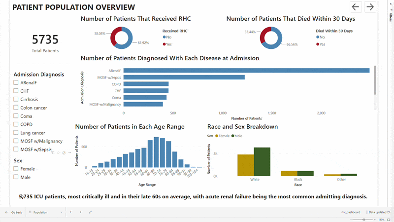
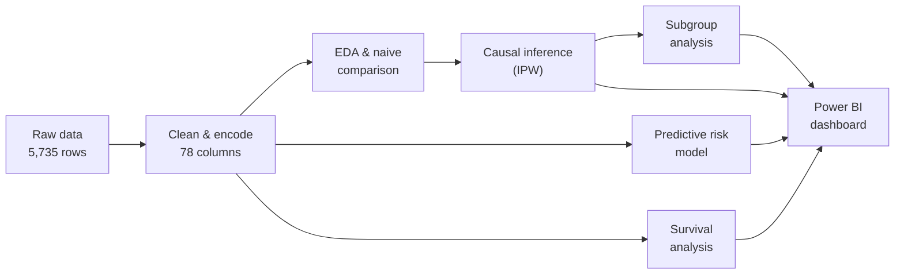
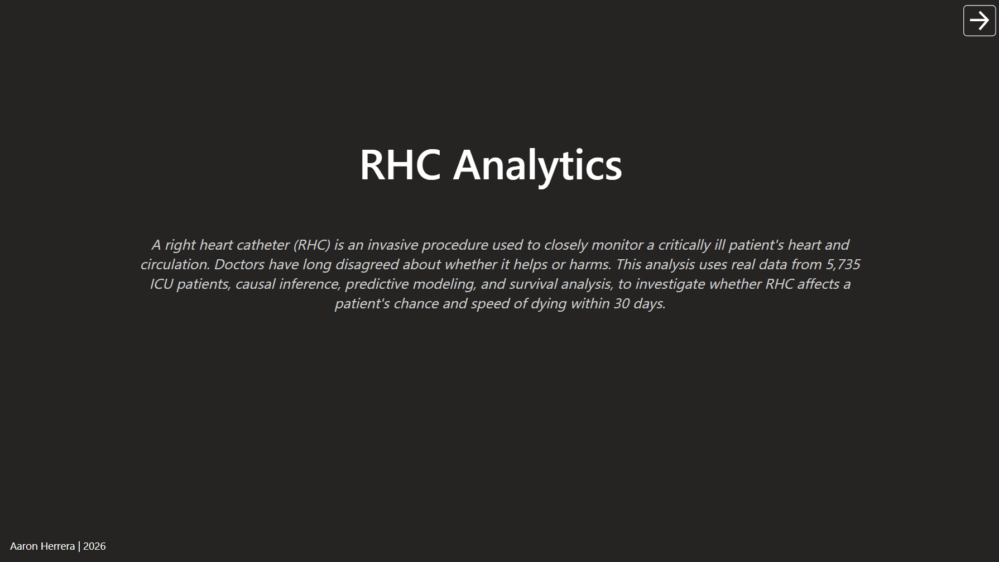
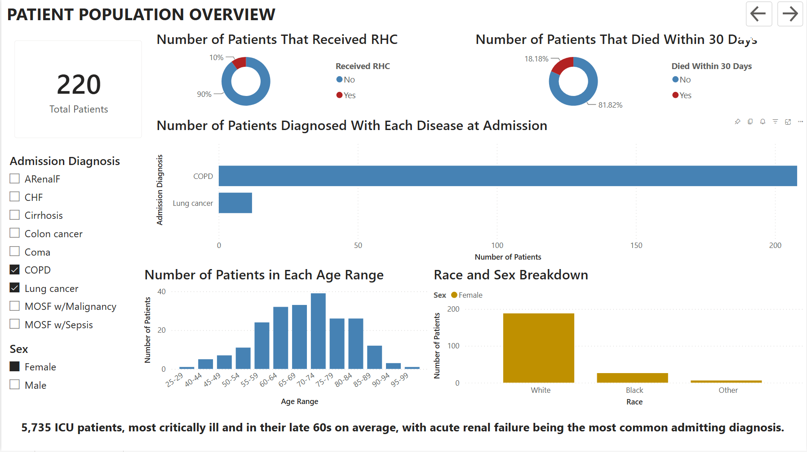
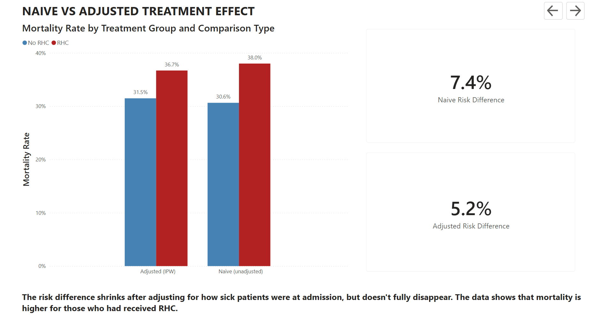
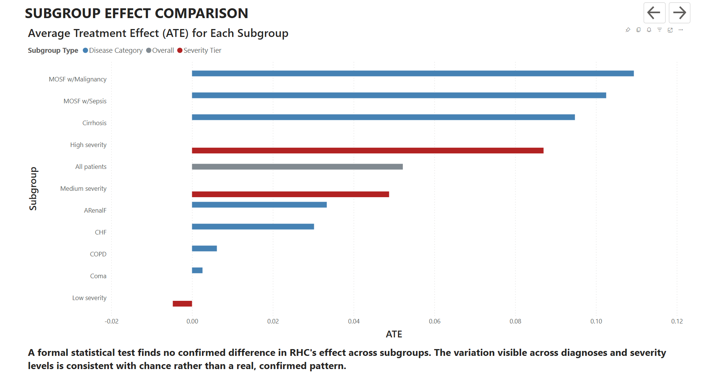
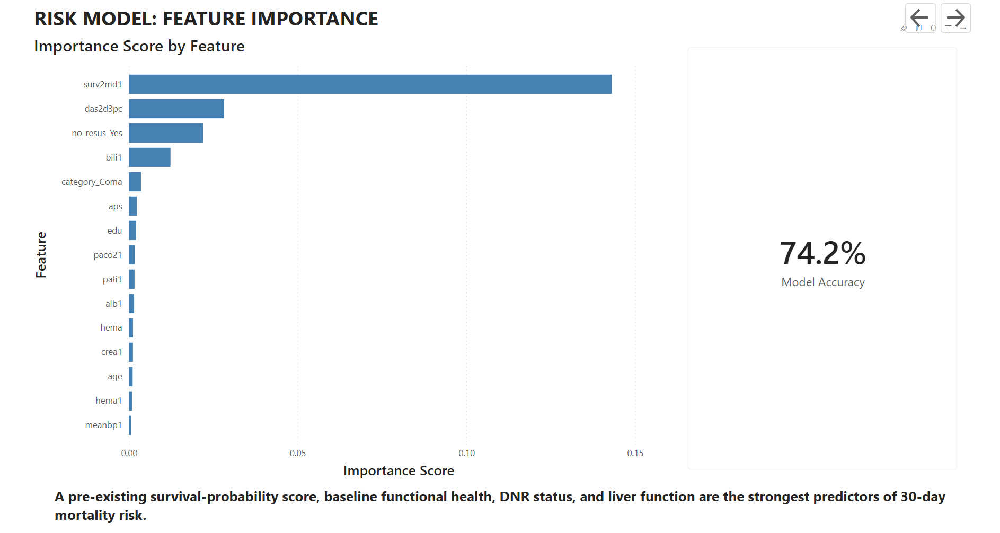
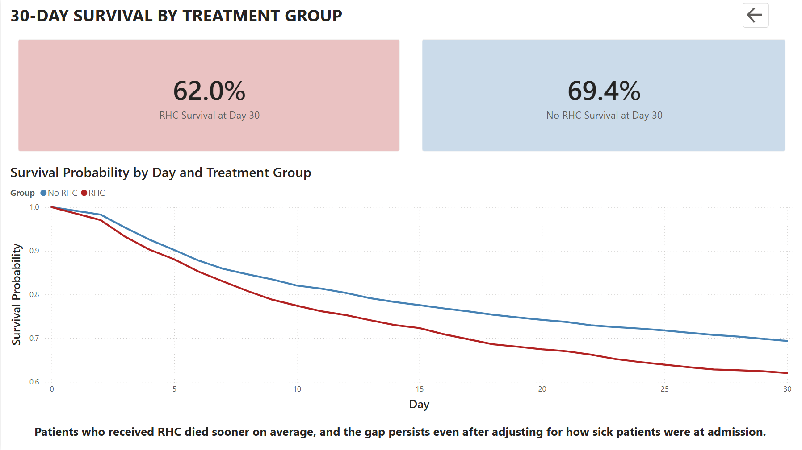

# RHC Analytics: Does Right Heart Catheterization Improve ICU Survival?

## Summary

Right heart catheterization (RHC) is a common but clinically disputed invasive ICU procedure. This project analyzes 5,735 ICU patients using causal inference, predictive modeling, and survival analysis to test whether RHC actually improves 30-day survival, or whether it just looks that way because sicker patients were more likely to receive it. Three independent statistical methods agree: RHC is associated with a statistically significant increase in 30-day mortality risk, even after adjusting for how sick patients were at admission.

## Dashboard Preview



## Problem

Clinicians have never reached consensus on whether RHC helps or harms patients, the study this dataset comes from (Connors et al., 1996, *JAMA*) was itself part of that decades-long controversy. Framed as an analyst problem, this is a selection-bias question that shows up constantly outside healthcare too: *does this intervention/campaign/program actually work, or are the people who received it just different to begin with?*

This project answers four specific questions:

1. **Causal**: Does RHC change a patient's 30-day mortality risk, once selection bias is accounted for?
2. **Predictive**: Which admission characteristics best predict mortality risk?
3. **Segmentation**: Does RHC's effect differ across patient subgroups (diagnosis, severity)?
4. **Time-to-event**: Does RHC change *when* patients die, not just *whether* they do?

## Key Insights

1. RHC is linked to a ~5 percentage point increase in 30-day mortality, even after adjusting for illness severity. The raw comparison shows 38.0% mortality for RHC patients vs. 30.6% for non-RHC patients, but that's confounded, RHC patients were meaningfully sicker at admission. After statistically reweighting patients so the two groups become comparable on every measured characteristic, the adjusted gap shrinks to +5.2 percentage points (95% confidence range: +1.9% to +8.5%) and remains significant.

2. A completely independent method confirms the same result. A survival-analysis model (Cox regression) estimating moment-to-moment mortality risk across the full 30 days found RHC patients faced about 25% higher risk of dying at any given time than similar patients who didn't receive it. Getting the same directional answer from two structurally different statistical methods is a strong signal this isn't a modeling artifact.

3. A predictive model correctly classifies 30-day mortality risk 74% of the time using only admission data. The strongest predictors were a pre-existing prognosis score, baseline functional health, DNR status, and liver function, largely consistent across both the predictive model and the survival model.

4. No patient subgroup shows a confirmed, statistically different RHC effect. RHC's effect was re-estimated within 7 disease categories and 3 severity tiers; a formal statistical test comparing all subgroups directly found no confirmed difference between them, the apparent variation is consistent with chance rather than a proven pattern.

## Recommendations

- Treat RHC as carrying real, non-trivial procedural risk, not a neutral diagnostic step, when weighing its use in similarly-composed ICU populations. The effect held up across two independent causal methods and didn't meaningfully vary by diagnosis or severity.
- Incorporate the top predictive risk factors (existing prognosis score, functional status, DNR status, liver function) into admission-time risk-scoring workflows, they were the strongest, most consistent predictors across two separate models.
- Treat this as hypothesis-generating for a prospective study, not final proof. Observational analysis cannot fully rule out unmeasured confounding (see Limitations); a randomized or quasi-experimental design would be the appropriate next step to confirm causality.

---

## Dataset

The Right Heart Catheterization dataset from the SUPPORT study (Connors et al., 1996), a widely used public dataset in causal inference research and teaching.

- **5,735 patient records**, 83 raw columns
- One flat file (`csv/rhc.csv`), columns span demographics, comorbidity history, day-1 vitals/labs, admission diagnosis, treatment, and outcomes

## Methodology



**Workflow**:

1. Import raw data, diagnose structure and missingness
2. Clean and encode, resolving 5 columns with missing values individually, based on *why* each was missing
3. Derive and validate outcome variables from raw dates 
4. Compute the naive (unadjusted) comparison and quantify covariate imbalance
5. Fit a propensity-score model and apply inverse probability weighting to estimate the adjusted causal effect
6. Train and compare 3 classifiers via cross-validated hyperparameter tuning; evaluate the winner once on a held-out test set
7. Re-estimate the treatment effect within patient subgroups; formally test whether it differs
8. Fit Kaplan-Meier curves and a Cox proportional-hazards model for time-to-event analysis
9. Export cleaned results into a 6-page Power BI dashboard

### Data Cleaning

Five columns had missing values; each was resolved based on *why* it was missing, not a blanket rule:

| Column | % missing | Decision | Reasoning |
| --- | --- | --- | --- |
| `dthdte` | 35.1% | Left null | Structural, missing exactly for survivors |
| `cat2` | 79.1% | Filled `"None"` | Missing means "no secondary diagnosis," not a gap |
| `adld3p` | 74.9% | Dropped | No structural cause, too sparse to impute |
| `urin1` | 52.8% | Dropped | Structural, missing exactly for survivors |
| `dschdte` | 0.02% | Column dropped entirely | Unused anywhere downstream |

Categorical variables were one-hot encoded from the raw text columns.

Outcome variables (`death`, `death_d30`, `survial_d30`) ship pre-computed in the dataset but were rebuilt from raw admission/death dates and validated to match exactly, one line of defense against silently trusting a black-box column:

### Analysis

- **Causal inference**: logistic regression propensity model on 63 covariates, using stabilized inverse probability weights, and weighted-least-squares treatment effect with robust standard errors. Covariate balance checked before and after weighting (34 of 63 covariates imbalanced before, 0 of 63 after).
- **Predictive modeling**: logistic regression, random forest, and gradient boosting, each hyperparameter-tuned via `GridSearchCV` under 5-fold cross-validation (CV); model selection based on CV score alone, the test set touched exactly once by the winning model. Feature importance via permutation importance (model-agnostic, unlike built-in impurity importance).
- **Subgroup analysis**: treatment effect re-estimated within 7 disease categories and 3 severity tiers (2 categories excluded for insufficient sample size); formal interaction tests (joint F-tests) rather than eyeballing confidence-interval overlap.
- **Survival analysis**: Kaplan-Meier curves with a log-rank test, plus a Cox proportional-hazards model (64 covariates) with a formal proportional-hazards assumption check, not just a fitted hazard ratio taken on faith.

## Dashboard

A 6-page Power BI dashboard (cover page + 5 analysis pages, one per required panel): population overview, naive-vs-adjusted effect, subgroup comparison, feature importance, and survival curves.








## Repository Structure

```text
RHC_Analytics/
├── scripts/           # Phase 1-7 pipeline, one script per analysis stage
├── csv/               # Generated data (gitignored, fully regenerable)
├── figures/           # Generated matplotlib figures 
├── powerbi/           # Power BI theme file and dashboard
├── requirements.txt
├── .gitignore
└── README.md
```

## Tools Used

- **Language**: Python 3.14
- **Data & stats**: pandas, numpy, statsmodels
- **Machine learning**: scikit-learn
- **Survival analysis**: lifelines
- **Visualization**: matplotlib
- **BI / reporting**: Power BI Desktop
- **Version control**: Git / GitHub

## Skills Demonstrated

- Principled missing-data diagnosis (structural vs. random missingness)
- Categorical encoding with deliberate, defensible reference categories
- Propensity-score modeling and inverse probability weighting
- Covariate balance diagnostics (standardized mean differences)
- Cross-validated hyperparameter tuning and leakage-free model selection
- Permutation feature importance
- Subgroup / heterogeneous treatment effect testing with multiple-comparison awareness
- Kaplan-Meier estimation and Cox proportional-hazards modeling with assumption checking
- Power BI dashboard design for a non-technical, stakeholder audience
- Git version control, including diagnosing and remediating an accidental commit

## Limitations

- Since this project used observational and not experimental data, unmeasured confounding may still exist. Adjustment accounts for every measured covariate, but some unmeasured factor could still influence both the RHC decision and the outcome.
- Any patient not known to have died within 30 days is treated as censored at exactly day 30, not their true last-contact date. This is the dataset's real design and worth knowing before interpreting the survival results.
- Some subgroups express covariate imbalance, even after adjustment. IPW weights are computed once and reused across subgroups for stability; three disease-category subgroups (CHF, Cirrhosis, COPD) show real residual covariate imbalance within them, so those three estimates should be trusted less than the overall and severity-tier results.
- Two covariates violate the Cox model's proportional-hazards assumption, which can influence the model's accuracy. RHC's own hazard ratio does not, so the headline finding is unaffected.
- Two disease categories were excluded (Colon cancer, Lung cancer) for having too few treated patients to produce a reliable estimate.

## How to Run

```bash
pip install -r requirements.txt
```

The raw source file (`csv/rhc.csv`) isn't included (third-party data); obtain the RHC dataset independently and place it at `csv/rhc.csv`. Then run the pipeline in order:

```bash
python scripts/data_clean.py
python scripts/eda_bias.py
python scripts/propensity_effect.py
python scripts/risk_model.py
python scripts/subgroup_effects.py
python scripts/survival_analysis.py
python scripts/dashboard_export.py
```

Or, to just explore the dashboard: open `powerbi/rhc_dashboard.pbix` in Power BI Desktop.

## Future Improvements

- Expand this README's findings into a standalone, deeper technical report covering full methodology, defense of each design decision, and more intensive analysis of results
- Add a sensitivity analysis for unmeasured confounding (e.g., an E-value) to quantify how strong an unmeasured confounder would need to be to explain away the result
- Estimate the average treatment effect on the treated (ATT) as a complementary estimand to the ATE reported here
- Can experiment with other models to handle covariates that violated constant hazard assumption

## Author

**Aaron Herrera** - [LinkedIn](https://www.linkedin.com/in/aaronherrera4/)

## Credit

As previously mentioned, this dataset comes from a previous study by Connors et al. (Connors et al., 1996, *JAMA*). The dataset for this project was downloaded at https://github.com/migariane/TutorialComputationalCausalInferenceEstimators. 
